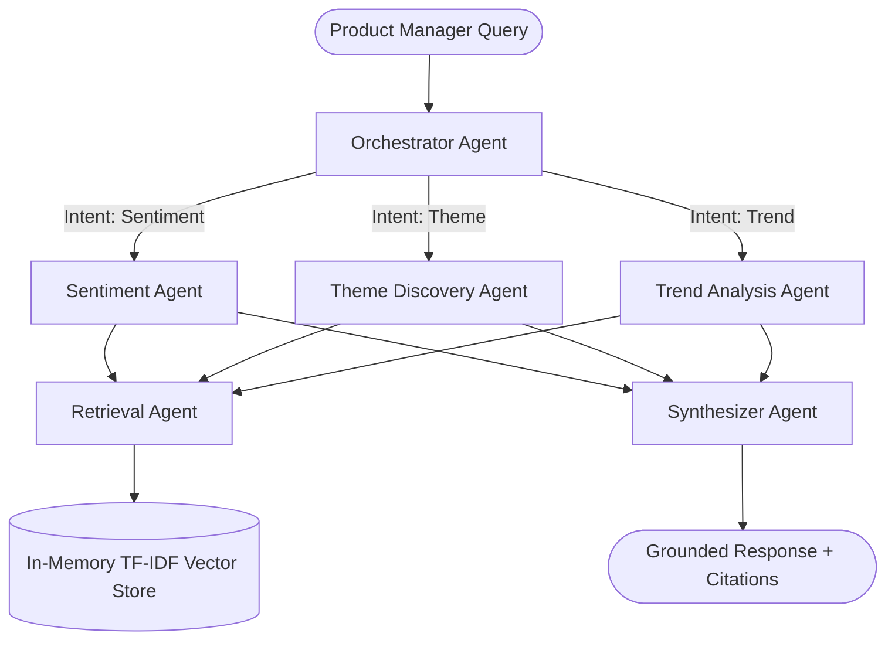

# 🎯 Havells Customer Voice Intelligence Agent

An agentic AI system built for the **AI Catalyst Program** that transforms raw, messy customer reviews of Havells consumer appliances into actionable product intelligence. 

The system automatically identifies recurring complaint themes, tracks sentiment shifts over time, and answers product manager queries in plain English — with every answer grounded strictly in actual review data.

---

## 🚀 Key Capabilities

1. **Aspect-Based Sentiment Analysis (ABSA)**: Evaluates sentiment across 10 specific product dimensions (e.g., motor noise, build quality, after-sales service).
2. **Unsupervised Theme Discovery**: Uses TF-IDF and KMeans clustering to surface emerging complaints and trends without requiring pre-labeled data.
3. **Multi-Agent Orchestration**: Intent-based routing sends queries to specialized agents (Retrieval, Sentiment, Theme, Trend, and Synthesizer).
4. **Strict Grounding**: Zero hallucination policy. Every natural language response includes source citations and explicit data coverage warnings.
5. **Temporal Trend Detection**: Analyzes rating and sentiment shifts month-over-month.

## 🏗 System Architecture

The architecture utilizes the **Orchestrator-Worker** pattern.



## 🛠 Tech Stack

- **Core Logic & ML**: Python 3.10+, Scikit-learn, NumPy, Pandas
- **Vector Search**: TF-IDF cosine similarity (ChromaDB-ready)
- **Sentiment & NLP**: Custom lexicon engine with negation handling
- **Testing**: `pytest`
- **PDF Generation**: `fpdf2`

## 📦 Project Structure

```
havells/
├── main.py                    # Main pipeline runner & interactive demo
├── requirements.txt           # Python dependencies
├── config/
│   └── settings.py            # Centralized configuration (thresholds, categories)
├── src/
│   ├── agents/
│   │   └── orchestrator.py    # Multi-agent system routing & synthesis
│   ├── core/
│   │   ├── data_ingestion.py  # Review cleaning & preprocessing
│   │   ├── sentiment_engine.py# ABSA & lexicon scoring
│   │   ├── theme_engine.py    # TF-IDF + KMeans clustering
│   │   ├── vector_store.py    # Grounded retrieval engine
│   │   └── evaluation.py      # Quality metrics
│   ├── data/
│   │   └── review_generator.py# Synthetic dataset generator
│   └── utils/
│       └── pdf_generator.py   # Solution report generator
├── tests/                     # pytest automated test suite
├── data/                      # Generated CSV/JSON datasets
└── output/                    # Generated PDF reports
```

## ⚙️ Installation & Usage

### 1. Set Up Environment
```bash
python3 -m venv .venv
source .venv/bin/activate
pip install -r requirements.txt
```

*(Optional)* Create a `.env` file if you are utilizing the LLM synthesis features:
```env
OPENAI_API_KEY="your_api_key_here"
```

### 2. Run the Full Pipeline & Demo
This command generates the synthetic dataset, runs the processing pipelines, computes evaluation metrics, runs sample queries, and generates the final PDF report.
```bash
python main.py
```

### 3. Run Interactive Q&A Mode
Chat with the system directly to query insights about Havells products.
```bash
python main.py --interactive
```

### 4. Run the Test Suite
The project includes a formal test suite verifying the integrity of the data pipeline, sentiment engine, and retrieval mechanics.
```bash
PYTHONPATH=. pytest -v tests/
```

## 🧠 Design Philosophy

- **Deterministic over Stochastic:** We utilize lexicon-based ABSA and TF-IDF clustering instead of raw LLMs for core data analysis. This makes the system incredibly fast, fully auditable, and mathematically deterministic.
- **Evidence over Eloquence:** The synthesizer agent is strictly prompted to admit when data is insufficient. Source citations are appended to all conclusions.

---
*Built for the Havells AI Catalyst Program | Set A: Customer Voice Intelligence*
